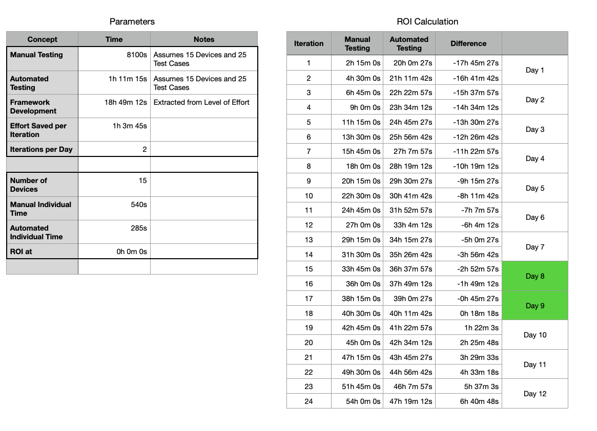

# Business Case for Android Testing Suite
May 20th, 2020  
SDET: *Luis Enrique Correa Morán*

## Table of Contents
1. [Scope](#10-scope)
2. [Approach](#20-approach-architecture)
3. [High Level Architecture & Process](#30-high-level-architecture--process)
4. [Level of Effort](#40-level-of-effort)
5. [Return of Investment](#50-return-of-investment)
6. [Project Benefits](#60-project-benefits)

## 1.0 Scope
The framework to be developed must cover the following requirements.
* Ability to test the correct functionality for the following Android Modules.
    * Phone App
    * Calculator App
    * Android
    
Android versions to be contained in the development process are defined below.
* Android 7 Nougat
* Android 8.0 Oreo
* Android 9.0 Pie
* Android 10.0 Q

Later versions of Android (9.0 & 10.0) will be prioritized as they have just recently entered the mainstream market, and hardly any bugs are likely to be found in earlier versions of the system. Especially given the fact that the Phone and Calculator apps are updated through the Google Play Store making Android fragmentation less of an issue.

Hardly any version of Android is similar to that of another OEM, *Personalization Layers* have been a trend in Android since 2008, and makes it harder to develop a highly optimized and scalable testing framework for all Android Flavors. Only AOSP Android and variants that resemple Pure Android versions will be considered for the framework.

Popular brands that follow this Software trend are described below, important to say that the list is representative and there may be other brands/manufacturers missing.

* Motorola Moto Series
* Google Pixels Series
* Motorola One Series
* Google Nexus Series
* OnePlus Series
* Nokia devices after 2016
* Xiaomi MI A3
* Redmi Go
* Some models of ASUS Zenphone
* PocoPhone Series

### 1.1 Reliability Test
The test aims to achieve reliability by reproducing consistent test cases (independent of Android version) among multiple devices. As well as having assertions on conditions that prove that the ultimate goal of a given test case is fulfilled.

### 1.2 Framework Mechanism
* SDK: E2E UI Workflow, that carries out human-like procedures on apps by simulating human interaction.
* GUI: Script Oriented and CLI tools available for the framework utilization.
* Log & Autoreporting: the framework will be able of generating the same logs a manual tester would and generate a csv report of them.
* History Reporting System: an historical archive of test runs will be created.
* Test Scheduler: the frameork is meant to be run at least once every day, though if multiple builds are generated in a day, it is possible to run them multiple times.
* Scalability for Devices: the framework won't run on simultaneous devices, but is able to add multiple devices on a run, so that tests on a device are executed right after the previous device finishes.
* Flexibility: Adiition of new test cases ir really easy, as well as new test assertions. Suites usually require a time consuming supporting library to be created, but test Suite addition is usually easy and fast.

## 2.0 Approach Architecture
The platform will be built on top of the Android Platform, over which the language python will be the base for developing any script or supporting library the framework requires.
Auxiliary formats like JSON and CSV will be used so that the framework is able of interacting with human readable elements for test input and output.

OpenSource libraries such as UIAutomator, ADB Shell and Python Open Source libraries will be used to create Supporting Libraries that will contain useful and repetitive tasks used by Testing Suites, that perform testing over an Android Module or App.

## 3.0 High Level Architecture & Process

## 4.0 Level of Effort
This table details the effort spent on every sprint for the project in terms of hours spent by the whole development team. From testers to developers, according to the proper activities of each task.  
A [spreadsheet version](Level%20of%20Effort.numbers) of this table is also available.

|                                   | Sprint 1 | Sprint 2 | Sprint 3 | Holidays |          | Sprint 4 | Sprint 5 | Sprint 8 | Summary   |      |
|-----------------------------------|----------|----------|----------|----------|----------|----------|----------|----------|-----------|------|
| Task Activity                     | 30/03/20 | 06/04/20 | 13/04/20 | 20/04/20 | 27/04/20 | 04/05/20 | 11/05/20 | 18/05/20 | Time/Task |      |
| Total Hours                       | 4.5      | 4.5      | 3.5      | 0        | 0        | 3.32     | 0.5      | 2.5      | 18.82     |      |
| Tool Installation & Reserach      | 3        | 2        |          |          |          |          |          |          | 5         | 12.5 |
| Test Case Design                  | 1        | 1        |          |          |          |          |          |          | 2         |      |
| Repo Initialization & Scaffolding | 0.5      | 0.5      |          |          |          |          |          |          | 1         |      |
| Supporting Libraries v1.0         |          |          | 2        |          |          |          |          |          | 2         |      |
| Test Case Implementation v1.0     |          |          | 0.5      |          |          |          |          |          | 0.5       |      |
| Execution & Reporting             |          |          | 0.5      |          |          |          |          |          | 0.5       |      |
| Documentation                     |          | 1        | 0.5      |          |          |          |          |          | 1.5       |      |
| Refactor for Logging              |          |          |          |          |          | 1        |          |          | 1         | 3.32 |
| Supporting Libraries v1.1         |          |          |          |          |          | 1        |          |          | 1         |      |
| Test Case Design v1.1             |          |          |          |          |          | 0.5      |          |          | 0.5       |      |
| Test Case Implementation v1.1     |          |          |          |          |          | 0.33     |          |          | 0.33      |      |
| Execution & Reporting             |          |          |          |          |          | 0.16     |          |          | 0.16      |      |
| Documentation                     |          |          |          |          |          | 0.33     |          |          | 0.33      |      |
| Refactor Phone Test Cases         |          |          |          |          |          |          | 0.5      |          | 0.5       | 3    |
| CLI                               |          |          |          |          |          |          |          | 0.5      | 0.5       |      |
| Documentation                     |          |          |          |          |          |          |          | 2        | 2         |      |

## 5.0 Return of Investment
With the framework running twice a day, and estimating a number of 15 devices to run the tests on, the Return of Investment is expected to be reached between de 8th and 9th days of running. The model can bee located in the following [numbers spreadsheet](Time%20for%20Running%20Test%20Suites.numbers) (requires numbers for macOS).

## 6.0 Project Benefits
The following key benefits have been identified.
* Scalability in terms of testing throughput, it is easier to create more server instances of the that run the framework than increasing the size of the human team.
* Testing team will be able of focusing on more challenging and fulfilling tasks rather than repetitive ones.
* Automatic error reporting and lack of human error in reports and test logs.
* Framework is able of running continuously, even more than two times a day.
* Focus from manpower can shift into other important stages of the testing process, such as RCA, Test Design, Bug Fixing.

### 6.1 Disadvantages
* Maintenance of the framework will require qualified testers & developers.
* Further development is required to create an adequate GUI for management and other areas.
