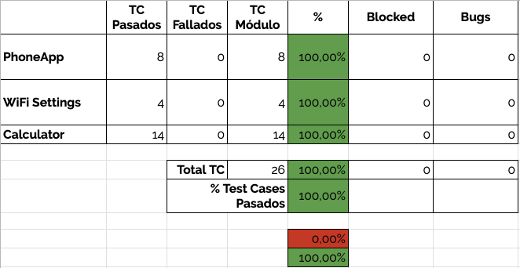

# Release Notes for Android Testing Suite v1.1
SDET: Luis Enrique Correa Morán
May 11th 2020

## Changelog
* Refactored Phone Module, to make test case creation and maintenance easier and faster in code.
* Added CLI Support.
* Fixed a bug with multiple devices.
* Managing of some common exceptions that caused the program to crash.
* Fixed [CALB_001](https://github.com/PrettyBoyHelios/SQAII/issues/5) for Test Case CAL_013.
* Added 2 Test Cases to the Phone Module.
* Added a Test Case to the Calculator Module.
* Test Plan & Business Case

## Scope
This release present the results for the third development stage and testing round for the Android Testing Suite. The first three modules, namely the PhoneApp, WiFi Settings & Calculator App modules will be considered for the testing process.

## Test Cases
All the test cases from the Test Case Suite were ran successfully. For more information on the test cases please review the [Test Case Document](https://docs.google.com/spreadsheets/d/1lIVIKKK4zOptjwTfsbyr2IaPt4KSgWGRoI6NxgrZMW0/edit?usp=sharing) in the shared folder.

## Test Framework Results
After running the testing suite, the application's output was the following, requiring a time of 2:43 minutes tu complete and passing 100.0% of the test cases.

|ID              |Start    |End      |Duration       |Module        |Test Case|Status |Error|FIELD9|
|----------------|---------|---------|---------------|--------------|---------|-------|-----|------|
|0260265948de4167| 22:45:53| 22:46:16| 0:00:22.963275| Calculator   | CAL_001 | PASSED|     |      |
|0260265948de4167| 22:46:16| 22:46:31| 0:00:14.980551| Calculator   | CAL_002 | PASSED|     |      |
|0260265948de4167| 22:46:31| 22:46:47| 0:00:15.906528| Calculator   | CAL_003 | PASSED|     |      |
|0260265948de4167| 22:46:47| 22:46:58| 0:00:11.574289| Calculator   | CAL_004 | PASSED|     |      |
|0260265948de4167| 22:46:58| 22:47:14| 0:00:16.126459| Calculator   | CAL_005 | PASSED|     |      |
|0260265948de4167| 22:47:14| 22:47:30| 0:00:15.893088| Calculator   | CAL_006 | PASSED|     |      |
|0260265948de4167| 22:47:30| 22:47:38| 0:00:07.350171| Calculator   | CAL_007 | PASSED|     |      |
|0260265948de4167| 22:49:02| 22:49:25| 0:00:22.450430| Calculator   | CAL_001 | PASSED|     |      |
|0260265948de4167| 22:49:25| 22:49:39| 0:00:14.696867| Calculator   | CAL_002 | PASSED|     |      |
|0260265948de4167| 22:49:39| 22:49:55| 0:00:15.896334| Calculator   | CAL_003 | PASSED|     |      |
|0260265948de4167| 22:49:55| 22:50:07| 0:00:11.939669| Calculator   | CAL_004 | PASSED|     |      |
|0260265948de4167| 22:50:07| 22:50:23| 0:00:15.950060| Calculator   | CAL_005 | PASSED|     |      |
|0260265948de4167| 22:50:23| 22:50:39| 0:00:15.752613| Calculator   | CAL_006 | PASSED|     |      |
|0260265948de4167| 22:50:39| 22:50:46| 0:00:07.616231| Calculator   | CAL_007 | PASSED|     |      |
|0260265948de4167| 22:50:46| 22:51:02| 0:00:15.926655| Calculator   | CAL_008 | PASSED|     |      |
|0260265948de4167| 22:51:02| 22:51:07| 0:00:04.822651| Calculator   | CAL_009 | PASSED|     |      |
|0260265948de4167| 22:51:07| 22:51:15| 0:00:08.165587| Calculator   | CAL_010 | PASSED|     |      |
|0260265948de4167| 22:51:15| 22:51:31| 0:00:15.705431| Calculator   | CAL_011 | PASSED|     |      |
|0260265948de4167| 22:51:31| 22:51:55| 0:00:23.788228| Calculator   | CAL_012 | PASSED|     |      |
|0260265948de4167| 22:51:55| 22:52:00| 0:00:05.538746| Calculator   | CAL_013 | PASSED|     |      |
|0260265948de4167| 22:52:00| 22:52:05| 0:00:05.134640| Calculator   | CAL_014 | PASSED|     |      |
|0260265948de4167| 22:52:05| 22:52:13| 0:00:07.092629| WiFi Settings| WFS_001 | PASSED|     |      |
|0260265948de4167| 22:52:13| 22:52:16| 0:00:03.523368| WiFi Settings| WFS_002 | PASSED|     |      |
|0260265948de4167| 22:52:16| 22:52:21| 0:00:05.257587| WiFi Settings| WFS_003 | PASSED|     |      |
|0260265948de4167| 22:52:21| 22:52:23| 0:00:01.936587| WiFi Settings| WFS_004 | PASSED|     |      |
|ZY326PJVC9      | 22:56:20| 22:56:41| 0:00:20.455143| Calculator   | CAL_001 | PASSED|     |      |
|ZY326PJVC9      | 22:56:41| 22:56:49| 0:00:08.278187| Calculator   | CAL_002 | PASSED|     |      |
|ZY326PJVC9      | 22:56:49| 22:56:58| 0:00:09.107051| Calculator   | CAL_003 | PASSED|     |      |
|ZY326PJVC9      | 22:56:58| 22:57:08| 0:00:09.513377| Calculator   | CAL_004 | PASSED|     |      |
|ZY326PJVC9      | 22:57:08| 22:57:17| 0:00:09.111223| Calculator   | CAL_005 | PASSED|     |      |
|ZY326PJVC9      | 22:57:17| 22:57:26| 0:00:09.037130| Calculator   | CAL_006 | PASSED|     |      |
|ZY326PJVC9      | 22:57:26| 22:57:33| 0:00:06.624097| Calculator   | CAL_007 | PASSED|     |      |
|ZY326PJVC9      | 22:57:33| 22:57:41| 0:00:08.490004| Calculator   | CAL_008 | PASSED|     |      |
|ZY326PJVC9      | 22:57:41| 22:57:45| 0:00:04.200611| Calculator   | CAL_009 | PASSED|     |      |
|ZY326PJVC9      | 22:57:45| 22:57:52| 0:00:06.262742| Calculator   | CAL_010 | PASSED|     |      |
|ZY326PJVC9      | 22:57:52| 22:58:01| 0:00:09.021096| Calculator   | CAL_011 | PASSED|     |      |
|ZY326PJVC9      | 22:58:01| 22:58:04| 0:00:03.514584| Calculator   | CAL_012 | PASSED|     |      |
|ZY326PJVC9      | 22:58:04| 22:58:08| 0:00:04.211221| Calculator   | CAL_013 | PASSED|     |      |
|ZY326PJVC9      | 22:58:08| 22:58:13| 0:00:04.250972| Calculator   | CAL_014 | PASSED|     |      |
|ZY326PJVC9      | 22:58:13| 22:58:24| 0:00:11.634571| WiFi Settings| WFS_001 | PASSED|     |      |
|ZY326PJVC9      | 22:58:24| 22:58:27| 0:00:03.277258| WiFi Settings| WFS_002 | PASSED|     |      |
|ZY326PJVC9      | 22:58:27| 22:58:33| 0:00:05.255994| WiFi Settings| WFS_003 | PASSED|     |      |
|ZY326PJVC9      | 22:58:33| 22:58:34| 0:00:01.760830| WiFi Settings| WFS_004 | PASSED|     |      |
|ZY326PJVC9      | 22:58:34| 22:58:43| 0:00:08.691618| PhoneCall    | PCS_001 | PASSED|     |      |
|ZY326PJVC9      | 22:58:43| 22:59:02| 0:00:18.918852| PhoneCall    | PCS_002 | PASSED|     |      |
|ZY326PJVC9      | 22:59:02| 22:59:39| 0:00:36.723714| PhoneCall    | PCS_003 | PASSED|     |      |
|ZY326PJVC9      | 22:59:39| 23:00:01| 0:00:22.362998| PhoneCall    | PCS_004 | PASSED|     |      |
|ZY326PJVC9      | 23:00:01| 23:00:10| 0:00:08.597891| PhoneCall    | PCS_005 | PASSED|     |      |
|ZY326PJVC9      | 23:00:10| 23:00:31| 0:00:21.023395| PhoneCall    | PCS_006 | PASSED|     |      |
|ZY326PJVC9      | 23:00:31| 23:00:46| 0:00:14.930236| PhoneCall    | PCS_007 | PASSED|     |      |
|ZY326PJVC9      | 23:00:46| 23:00:55| 0:00:09.543444| PhoneCall    | PCS_008 | PASSED|     |      |
|0260265948de4167| 23:02:30| 23:02:48| 0:00:18.101749| Calculator   | CAL_001 | PASSED|     |      |
|0260265948de4167| 23:02:48| 23:03:03| 0:00:14.669428| Calculator   | CAL_002 | PASSED|     |      |
|0260265948de4167| 23:03:03| 23:03:19| 0:00:16.084789| Calculator   | CAL_003 | PASSED|     |      |
|0260265948de4167| 23:03:19| 23:03:30| 0:00:11.177145| Calculator   | CAL_004 | PASSED|     |      |
|0260265948de4167| 23:03:30| 23:03:46| 0:00:15.644384| Calculator   | CAL_005 | PASSED|     |      |
|0260265948de4167| 23:03:46| 23:04:01| 0:00:15.868755| Calculator   | CAL_006 | PASSED|     |      |
|0260265948de4167| 23:04:01| 23:04:08| 0:00:07.063798| Calculator   | CAL_007 | PASSED|     |      |
|0260265948de4167| 23:04:08| 23:04:24| 0:00:15.515738| Calculator   | CAL_008 | PASSED|     |      |
|0260265948de4167| 23:04:24| 23:04:29| 0:00:04.748784| Calculator   | CAL_009 | PASSED|     |      |
|0260265948de4167| 23:04:29| 23:04:37| 0:00:08.055332| Calculator   | CAL_010 | PASSED|     |      |
|0260265948de4167| 23:04:37| 23:04:52| 0:00:15.468945| Calculator   | CAL_011 | PASSED|     |      |
|0260265948de4167| 23:04:52| 23:05:16| 0:00:23.321003| Calculator   | CAL_012 | PASSED|     |      |
|0260265948de4167| 23:05:16| 23:05:20| 0:00:04.920129| Calculator   | CAL_013 | PASSED|     |      |
|0260265948de4167| 23:05:20| 23:05:26| 0:00:05.488919| Calculator   | CAL_014 | PASSED|     |      |
|ZY326PJVC9      | 23:05:26| 23:05:41| 0:00:14.871757| Calculator   | CAL_001 | PASSED|     |      |
|ZY326PJVC9      | 23:05:41| 23:05:48| 0:00:07.374428| Calculator   | CAL_002 | PASSED|     |      |
|ZY326PJVC9      | 23:05:48| 23:05:58| 0:00:09.874909| Calculator   | CAL_003 | PASSED|     |      |
|ZY326PJVC9      | 23:05:58| 23:06:08| 0:00:09.572885| Calculator   | CAL_004 | PASSED|     |      |
|ZY326PJVC9      | 23:06:08| 23:06:17| 0:00:09.357134| Calculator   | CAL_005 | PASSED|     |      |
|ZY326PJVC9      | 23:06:17| 23:06:26| 0:00:08.974212| Calculator   | CAL_006 | PASSED|     |      |
|ZY326PJVC9      | 23:06:26| 23:06:32| 0:00:06.108700| Calculator   | CAL_007 | PASSED|     |      |
|ZY326PJVC9      | 23:06:32| 23:06:41| 0:00:09.071795| Calculator   | CAL_008 | PASSED|     |      |
|ZY326PJVC9      | 23:06:41| 23:06:45| 0:00:04.190585| Calculator   | CAL_009 | PASSED|     |      |
|ZY326PJVC9      | 23:06:45| 23:06:52| 0:00:06.420252| Calculator   | CAL_010 | PASSED|     |      |
|ZY326PJVC9      | 23:06:52| 23:07:01| 0:00:08.831829| Calculator   | CAL_011 | PASSED|     |      |
|ZY326PJVC9      | 23:07:01| 23:07:12| 0:00:11.550100| Calculator   | CAL_012 | PASSED|     |      |
|ZY326PJVC9      | 23:07:12| 23:07:16| 0:00:04.161814| Calculator   | CAL_013 | PASSED|     |      |
|ZY326PJVC9      | 23:07:16| 23:07:20| 0:00:04.089445| Calculator   | CAL_014 | PASSED|     |      |
|ZY224QWRPJ      | 23:21:15| 23:21:48| 0:00:33.265117| Calculator   | CAL_001 | PASSED|     |      |
|ZY224QWRPJ      | 23:21:48| 23:22:08| 0:00:19.906823| Calculator   | CAL_002 | PASSED|     |      |
|ZY224QWRPJ      | 23:22:08| 23:22:26| 0:00:17.949089| Calculator   | CAL_003 | PASSED|     |      |
|ZY224QWRPJ      | 23:22:26| 23:22:33| 0:00:06.999544| Calculator   | CAL_004 | PASSED|     |      |
|ZY224QWRPJ      | 23:22:33| 23:22:54| 0:00:20.738076| Calculator   | CAL_005 | PASSED|     |      |
|ZY224QWRPJ      | 23:22:54| 23:23:22| 0:00:28.164819| Calculator   | CAL_006 | PASSED|     |      |
|ZY224QWRPJ      | 23:23:22| 23:23:32| 0:00:10.189401| Calculator   | CAL_007 | PASSED|     |      |
|ZY224QWRPJ      | 23:23:32| 23:23:46| 0:00:13.973213| Calculator   | CAL_008 | PASSED|     |      |
|ZY224QWRPJ      | 23:23:46| 23:23:50| 0:00:04.183927| Calculator   | CAL_009 | PASSED|     |      |
|ZY224QWRPJ      | 23:23:50| 23:23:58| 0:00:07.617211| Calculator   | CAL_010 | PASSED|     |      |
|ZY224QWRPJ      | 23:23:58| 23:24:12| 0:00:14.092963| Calculator   | CAL_011 | PASSED|     |      |
|ZY224QWRPJ      | 23:24:12| 23:24:39| 0:00:26.595665| Calculator   | CAL_012 | PASSED|     |      |
|ZY224QWRPJ      | 23:24:39| 23:24:44| 0:00:05.498614| Calculator   | CAL_013 | PASSED|     |      |
|ZY224QWRPJ      | 23:24:44| 23:24:52| 0:00:08.029456| Calculator   | CAL_014 | PASSED|     |      |
|ZY224QWRPJ      | 23:30:13| 23:30:24| 0:00:10.487476| WiFi Settings| WFS_001 | PASSED|     |      |
|ZY224QWRPJ      | 23:30:24| 23:30:28| 0:00:04.519657| WiFi Settings| WFS_002 | PASSED|     |      |
|ZY224QWRPJ      | 23:30:28| 23:30:34| 0:00:05.612243| WiFi Settings| WFS_003 | PASSED|     |      |
|ZY224QWRPJ      | 23:30:34| 23:30:37| 0:00:03.432732| WiFi Settings| WFS_004 | PASSED|     |      |

### Patch Hotfix
It was required to rerun the PhoneCall Suite to guarantee the Android v8.0 patch did not affect the upper versions.  

|ID        |Start    |End      |Duration       |Module    |Test Case|Status |Error|FIELD9|
|----------|---------|---------|---------------|----------|---------|-------|-----|------|
|ZY224QWRPJ| 16:35:39| 16:35:52| 0:00:13.362561| PhoneCall| PCS_001 | PASSED|     |      |
|ZY224QWRPJ| 16:35:52| 16:36:08| 0:00:15.667583| PhoneCall| PCS_002 | PASSED|     |      |
|ZY224QWRPJ| 16:36:08| 16:36:18| 0:00:10.244336| PhoneCall| PCS_003 | PASSED|     |      |
|ZY224QWRPJ| 16:36:18| 16:36:27| 0:00:09.098187| PhoneCall| PCS_004 | PASSED|     |      |
|ZY224QWRPJ| 16:39:05| 16:39:18| 0:00:13.661432| PhoneCall| PCS_001 | PASSED|     |      |
|ZY224QWRPJ| 16:39:18| 16:39:34| 0:00:15.596672| PhoneCall| PCS_002 | PASSED|     |      |
|ZY224QWRPJ| 16:39:34| 16:39:51| 0:00:17.372823| PhoneCall| PCS_003 | PASSED|     |      |
|ZY224QWRPJ| 16:39:51| 16:40:14| 0:00:22.752194| PhoneCall| PCS_004 | PASSED|     |      |
|ZY224QWRPJ| 16:40:14| 16:40:23| 0:00:09.033693| PhoneCall| PCS_005 | PASSED|     |      |
|ZY224QWRPJ| 16:40:23| 16:40:43| 0:00:20.257635| PhoneCall| PCS_006 | PASSED|     |      |
|ZY224QWRPJ| 16:40:43| 16:40:57| 0:00:13.668630| PhoneCall| PCS_007 | PASSED|     |      |
|ZY224QWRPJ| 16:40:57| 16:41:09| 0:00:11.704671| PhoneCall| PCS_008 | PASSED|     |      |
|ZY326PJVC9| 16:42:02| 16:42:16| 0:00:14.342887| PhoneCall| PCS_001 | PASSED|     |      |
|ZY326PJVC9| 16:42:16| 16:42:31| 0:00:14.894673| PhoneCall| PCS_002 | PASSED|     |      |
|ZY326PJVC9| 16:44:49| 16:45:03| 0:00:14.003704| PhoneCall| PCS_001 | PASSED|     |      |
|ZY326PJVC9| 16:45:03| 16:45:18| 0:00:14.598516| PhoneCall| PCS_002 | PASSED|     |      |
|ZY326PJVC9| 16:45:18| 16:45:39| 0:00:20.879993| PhoneCall| PCS_003 | PASSED|     |      |
|ZY326PJVC9| 16:45:39| 16:46:03| 0:00:23.629588| PhoneCall| PCS_004 | PASSED|     |      |
|ZY326PJVC9| 16:46:03| 16:46:11| 0:00:08.328291| PhoneCall| PCS_005 | PASSED|     |      |
|ZY326PJVC9| 16:46:11| 16:46:32| 0:00:21.350760| PhoneCall| PCS_006 | PASSED|     |      |
|ZY326PJVC9| 16:46:32| 16:46:47| 0:00:14.665863| PhoneCall| PCS_007 | PASSED|     |      |
|ZY326PJVC9| 16:46:47| 16:46:57| 0:00:09.647160| PhoneCall| PCS_008 | PASSED|     |      |
## Test Suites Summary
The summary for all test cases ran for the test suite is presented below. To get further information please go to the [Test Suite Description](https://docs.google.com/spreadsheets/d/1lIVIKKK4zOptjwTfsbyr2IaPt4KSgWGRoI6NxgrZMW0/edit?usp=sharing) and the [Traceability Matrix](https://docs.google.com/spreadsheets/d/1ImSk6ZnVjv0hb979DL8E2sTEJRABI6YCLwi3vEQBZWg/edit?usp=sharing).

## Bug Reports
There was only one bug reported for this release TSB_001, which was patched before release and testing for the affected module (Phone Module) was carried out successfully.

## Action Plan
Proceeding to deploy the v1.2 of the Android Testing Suite. Carried bugs from previous versions have been now solved.